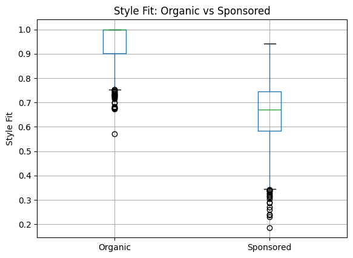
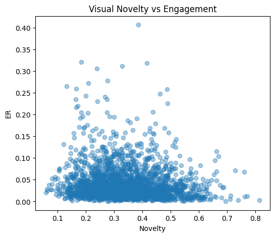
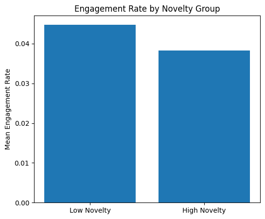

# Influencer Advertising Effectiveness Analysis

## Overview

This project investigates what drives engagement in influencer advertising using large-scale Instagram data.

The central research question is:

> What determines successful influencer advertising: brand authenticity or creator authenticity?

To answer this, we analyzed visual consistency, semantic alignment, and engagement behavior across sponsored and organic posts.

---

## Dataset

This study uses a large-scale Instagram influencer dataset.

### Original Dataset

- 1,601,074 Instagram posts

### Final Sample

- 417,788 image-matched posts
- 6,387 qualified creators
- 155,688 filtered posts
- 70,254 balanced posts
- 8,000 CLIP image samples

---

## Methods

This project combines multimodal representation learning and statistical modeling.

### Visual Analysis

- CLIP image embeddings (512 dimensions)
- Creator baseline style modeling
- Cosine similarity

### Statistical Analysis

- Engagement Rate (ER)
- Novelty modeling
- OLS regression

---

## Key Findings

### 1. Sponsored posts deviate from creators' usual visual style.

### 2. Higher visual novelty leads to lower engagement.

### 3. Brand semantic/category alignment showed weak predictive power.

### Final Insight

> **Consumers respond more strongly to creator authenticity than brand authenticity.**

---

## Figures

### Style Fit Comparison

---

### Visual Novelty vs Engagement

---

### Engagement by Novelty Group

---

## Reproducibility

Full analysis notebook:

[Full Analysis Pipeline](notebooks/full_analysis_pipeline.ipynb)
## Paper

Full paper:

[Research Paper (PDF)](paper/Creator_Authenticity_in_Influencer_Advertising.pdf)

---

## Author

[Dongju Shin GitHub Profile](https://github.com/crobro234?utm_source=chatgpt.com)  
University of Seoul  
Mathematics + Artificial Intelligence
